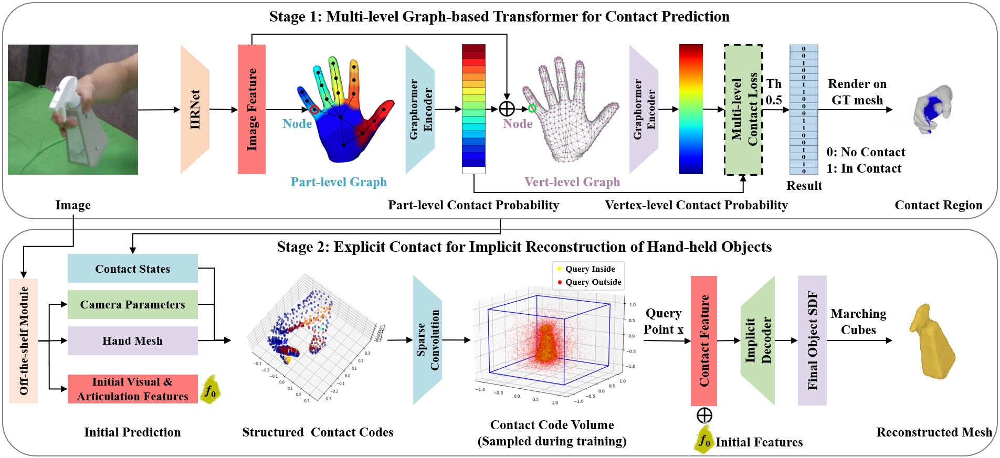

# CHOI

This repository is the official implementation of the following paper:

**Learning Explicit Contact for Implicit Reconstruction of Hand-held Objects from Monocular Images** 

Junxing Hu, Hongwen Zhang, Zerui Chen, Mengcheng Li, Yunlong Wang, Yebin Liu, Zhenan Sun

AAAI, 2024

[[Project Page]](https://junxinghu.github.io/projects/hoi.html) [[Paper]](https://arxiv.org/abs/2305.20089)

[](https://junxinghu.github.io/projects/hoi.html)


## Requirements

- Python 3.8
```
conda create --no-default-packages -n choi python=3.8
conda activate choi
```

- [PyTorch](https://www.pytorch.org) is tested on version 1.8.0
```
conda install pytorch==1.8.0 torchvision==0.9.0 cudatoolkit=11.1.1 -c pytorch -c conda-forge
```

- Other packages are listed in `requirements.txt`
```
pip install -r requirements.txt
```


## Pre-trained Model and Dataset

- Unzip `weights.zip` and the pre-trained model is placed in the `./weights/ho3d/checkpoints` directory

- Unzip `data.zip` and the processed data and corresponding SDF files are placed in the `./data` directory

- Download the [HO3D](https://github.com/shreyashampali/ho3d) dataset and put it into the `./data/ho3d` directory

- Download the [MANO](https://mano.is.tue.mpg.de/) model `MANO_RIGHT.pkl` and put it into the `./externals/mano` directory

## Evaluation
- To evaluate my model on HO3D, run:
```eval
python -m models.choi --config-file experiments/ho3d.yaml --ckpt weights/ho3d/checkpoints/ho3d_weight.ckpt
```
- The resulting file is generated in the `./output` directory


## Results
Our method achieves the following performance on the HO3D test set:

| Method | F@5mm | F@10mm | Chamfer Distance (mm) |
| :----  | :---: | :----: | :-------------------: |
| CHOI (Ours)   | 0.393 | 0.633  |      0.646            |

For video inputs from the OakInk dataset:

<p align="left">
    
    
    <br>
    <sup>The video is reconstructed frame-by-frame without post-processing. The objects are unseen during the training.</sup>
</p>

More results: [Project Page](https://junxinghu.github.io/projects/hoi.html)


## Citation
If you find our work useful in your research, please consider citing:

```bibtex
@inproceedings{hu2024learning,
  title={Learning Explicit Contact for Implicit Reconstruction of Hand-held Objects from Monocular Images},
  author={Hu, Junxing and Zhang, Hongwen and Chen, Zerui and Li, Mengcheng and Wang, Yunlong and Liu, Yebin and Sun, Zhenan},
  booktitle={Proceedings of the AAAI Conference on Artificial Intelligence},
  year={2024}
}
```


## Acknowledgments
Part of the code is borrowed from [IHOI](https://github.com/JudyYe/ihoi), [Neural Body](https://github.com/zju3dv/neuralbody), and [MeshGraphormer](https://github.com/microsoft/MeshGraphormer). Many thanks for their contributions.

